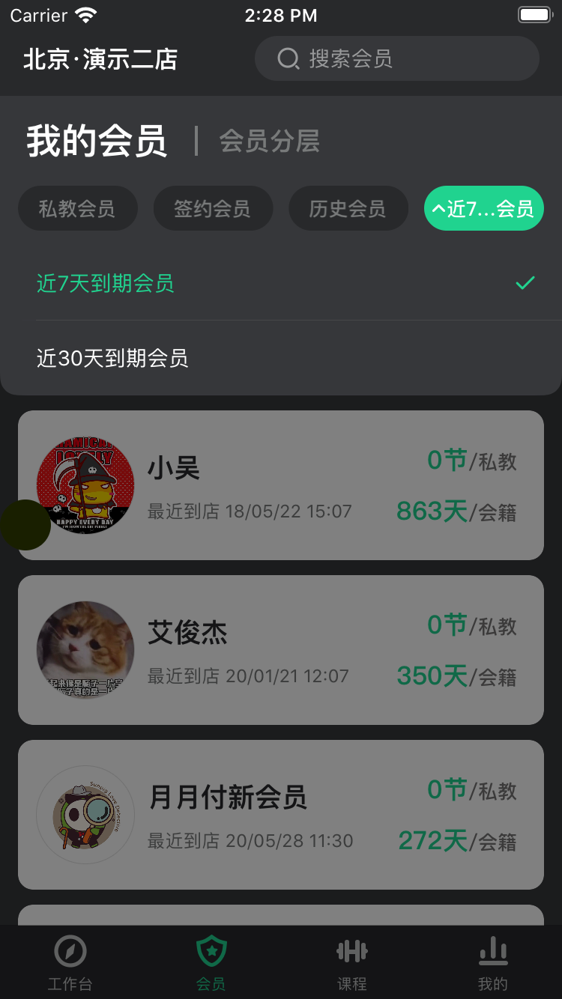

# isa-Swizzling

iOS中以前只知道``isa-Swizzling``是KVO的实现原理,但是没有在业务中实际实践过,这次有个弹窗的需求,正好可以拿来试试.



如上图,在弹窗展开``show``的时候,用户是可以点击其他的按钮如``搜索``,``会员分层``等这些不在弹出的view上的按钮.

因为是把弹窗加到的keywindow上,这样在点搜索的时候,没办法判断弹窗是否在展示,就不会让弹窗收回,造成view错乱的现象.

初步想的有2种解决方法,

* 利用View的手势UIGestureRecognizer.
* 利用view的hitTest触摸事件响应链.


####1.手势UIGestureRecognizer.

给ViewController的view添加TapGestureRecognizer手势.

因为页面的控件都是添加在view上的,所以可以通过tap手势的方法,在delegate里面监听点击事件,如果点击在view上就通过通知移除menuView;

但是有个问题是当点击其他按钮的时候,delegate是监听不到事件的.

####2.view的hitTest

事件响应链,当点击不在特定的范围内或者不在特定的子控件上的时候,发送通知.

使用UIView的category扩展,替换当前``viewcontroller``的``view``,在扩展中动态添加一个``UIView``的子类,使用``isa-swizzling``让替换``view``的isa指向,令``view``成为``custom_view``的实例对象,``custom_view``继承自``UIView.``

````objective-c
-(void)observeCurrentWindowisShowMenuView {
    
    NSString *className = [NSString stringWithFormat:@"custom_%@", self.class];
    Class kclass = objc_getClass([className UTF8String]);
    if (!kclass) {
        kclass = objc_allocateClassPair(self.class, [className UTF8String], 0);
        objc_registerClassPair(kclass);
    }
  
  	//custom_view的hitTest方法的指向
    SEL setterSelector = NSSelectorFromString(@"hitTest:withEvent:");
    Method setterMethod = class_getInstanceMethod(self.class, setterSelector);
    const char *types = method_getTypeEncoding(setterMethod);
  	//custom添加方法,但是方法的imp指向custom_HitTest
    class_addMethod(kclass, setterSelector, (IMP)custom_HitTest, types);
    object_setClass(self, kclass);
}

static UIView * custom_HitTest(id self, SEL _cmd, CGPoint point, UIEvent *event) {
    
    struct objc_super superclass = {
        .receiver = self,
        .super_class = class_getSuperclass(object_getClass(self))
    };

  //调用父类的hitTest
    UIView * (*objc_msgSendSuperCasted)(const void *, SEL, CGPoint, UIEvent *) = (void *)objc_msgSendSuper;
    UIView *view = objc_msgSendSuperCasted(&superclass, _cmd, point, event);
    
  //这里做发通知的操作
    NSLog(@"custom_HitTest -- %@", view.class);
    const char *name = "menu_UIButton";
    if (![view isKindOfClass: objc_getClass(name)]) {
        [SPDropMenuTool removeDropMenuFromKeyWindow];
    }
    
    return view;
}
````

对Button的扩展:

````objective-c
-(void)menuFromSubClass {
    NSString *className = [NSString stringWithFormat:@"menu_%@", self.class];
    Class kClass = objc_getClass([className UTF8String]);
    if (!kClass) {
        kClass = objc_allocateClassPair(self.class, [className UTF8String], 0);
        objc_registerClassPair(kClass);
    }
    object_setClass(self, kClass);
}
````


这样就通过isa-Swizzing替换了``view``,没有改动原有项目结构,就算有其他业务需求的时候view不是继承自UIView,也可以通过custom创建对应的子类.
